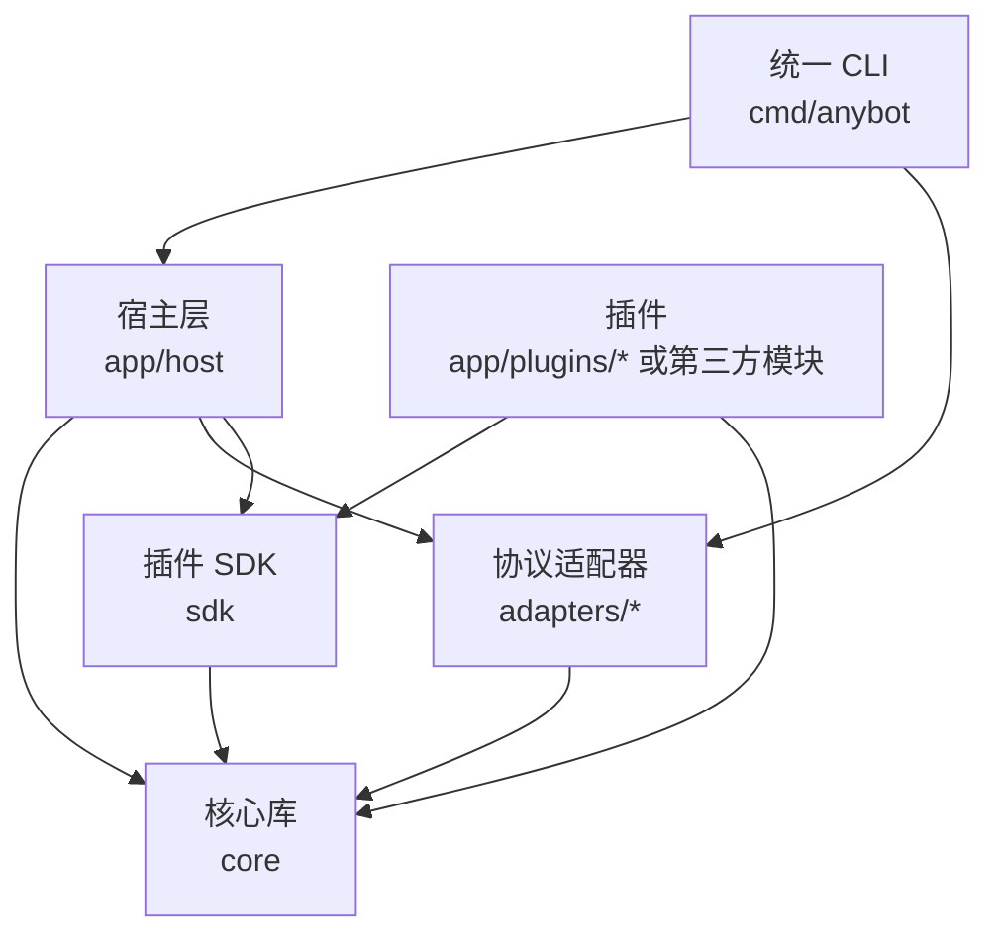

# 架构分层

AnyBot 是单 Go module 下的三个项目目录：

1. 核心库：`core/`，导入路径 `github.com/tty00a381/anybot/core`。
2. 应用宿主：`app/` 与统一 CLI `cmd/anybot`。
3. 插件 SDK：`sdk/`。

这个分层让 AnyBot 同时服务三类人：直接写 Go 的开发者、只想配置机器人和插件的最终用户、发布可复用插件的插件作者。它们放在同一个 module 里，避免多模块版本同步和 workspace 复杂度；目录边界负责清晰，发布单元保持简单。

## 核心库

`core/` 是运行时内核，负责：

- `App` 生命周期。
- 事件调度和路由。
- 中间件。
- observer。
- 生命周期托管任务。
- 会话存储。
- 消息链。
- 动作客户端抽象。
- 适配器接口。
- adapter readiness。
- App 级超级用户。

核心库不读取 `anybot.yaml`，不管理外部插件工作区，也不理解插件下载方式。它应该保持小而硬。

Middleware 是核心库里的横切机制，主要服务框架作者和插件作者：日志、恢复、鉴权、限速、超时这类能力可以用它包住路由链。最终用户不需要理解 middleware；他们面对的是插件、配置和 `anybot` CLI。插件框架层也不应该把所有扩展都塞进 middleware：会改变路由决策的交互逻辑放 route，只旁路记录事件的能力放 observer，后台循环放 lifecycle task。

## 协议适配器

`adapters/` 放协议适配器。当前重点是 `adapters/onebot11`。

适配器负责：

- 接收协议事件。
- 标准化为 AnyBot `Event`。
- 实现动作客户端。
- 把 `message.Chain` 转成协议消息。
- 报告动作通道状态。

协议端扩展能力应放在适配器的子包里。例如 NapCat 扩展位于 `adapters/onebot11/napcat`，避免污染标准 OneBot v11 API。

## 应用宿主

`app/host/` 是 `anybot` 的可复用宿主层，负责：

- 读取 `anybot.yaml`。
- 合并 `plugins.d/`。
- 创建 `App`。
- 装配 OneBot v11 适配器。
- 注册内置插件。
- 构建插件状态表。
- 同步插件默认配置。
- 管理外部插件工作区。

`cmd/anybot` 是统一 CLI。主命令面向最终用户，`dev` 子命令面向直接写 Go 的开发者。它负责命令行体验：

- 初始化目录。
- 诊断配置。
- 运行宿主。
- 构建生成宿主。
- 添加、移除、启用、禁用、同步、查看插件。

## 插件 SDK

`sdk/` 面向可复用插件作者。

插件通过 `sdk.Spec[T]` 声明：

- 插件清单。
- typed config。
- 默认配置。
- 配置校验。
- 安装逻辑。

宿主把 YAML 解码成插件的 typed config，再把插件装进核心 `App`。插件作者不需要自己设计配置加载、默认值、环境变量和校验流程。

## 外部插件工作区

生成出来的 AnyBot 工作目录是宿主应用项目，不是独立框架源码目录。外部插件通过 `anybot.plugins.yaml` 记录：

```yaml
module: anybot.local/bot
plugins:
  - name: weather
    module: github.com/acme/anybot-weather
    version: v0.1.0
    symbol: Module
```

`anybot plugin add/remove` 重写 `plugins.gen.go`。`anybot build/up` 会同步生成宿主对 AnyBot 根模块和外部插件的 `require/replace`。

源码开发版会把 AnyBot 自身替换到当前源码目录；发布版会固定到当前框架版本。这样生成宿主不会追随不确定的 `latest`。

## 配置边界

主 `anybot.yaml` 保存宿主级配置：

- runtime
- adapter
- security
- 简单内置插件

复杂插件配置放在 `plugins.d/<name>.yaml`。文件名就是插件运行名。同名插件不能同时出现在主配置和拆分配置里。

这种设计避免了 include 顺序和覆盖规则，也让大型插件拥有独立配置文件。

## 依赖方向



核心库不反向依赖宿主或插件 SDK。插件 SDK 依赖核心库，但核心库不知道 SDK。宿主层组合核心库、适配器和插件 SDK。这个方向必须保持清晰。
